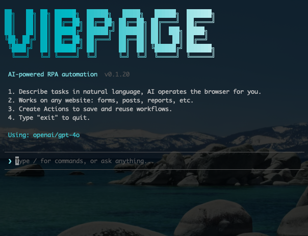

# VibPage

AI-powered content creation and publishing CLI. Write articles with AI assistance, then publish directly to Cloudflare Pages from your terminal.



## Features

- **AI Writing** - Ask the AI to write articles, blog posts, or any content in Markdown
- **Web Research** - Search the web, fetch pages, and take screenshots for research
- **One-Command Publish** - Build with Astro and deploy to Cloudflare Pages via `/publish`
- **Multi-Language** - Supports 9 languages: 简体中文, 繁體中文, English, Français, Deutsch, Español, Português, 한국어, 日本語
- **Slash Commands** - Arrow-key navigable command menu with `/` prefix
- **Multi-Model** - Supports Anthropic, OpenAI, and Google AI models

## Install

```bash
git clone https://github.com/eickegao/VibPage.git
cd VibPage
npm install
npm run build
npm link
```

## Setup

Create `~/.vibpage/config.json`:

```json
{
  "provider": "openai",
  "model": "gpt-4o",
  "apiKey": "your-api-key"
}
```

Supported providers: `anthropic`, `openai`, `google`

You can also use environment variables: `ANTHROPIC_API_KEY`, `OPENAI_API_KEY`, `GOOGLE_API_KEY`

## Usage

```bash
# Run in any directory
vibpage

# With options
vibpage -p anthropic -m claude-sonnet-4-20250514
```

### Slash Commands

Type `/` to see available commands:

| Command | Description |
|---------|-------------|
| `/publish` | Build and deploy to Cloudflare Pages |
| `/init` | Initialize project |
| `/status` | Show project status |
| `/language` | Set response language |
| `/help` | Show all commands |
| `/exit` | Quit |

### Publishing

On first publish, VibPage will:
1. Run `wrangler login` to open browser for Cloudflare OAuth
2. Create the Cloudflare Pages project if needed
3. Build with Astro and deploy

No manual API tokens required.

## Project Structure

```
src/
├── index.tsx          # CLI entry, banner, startup
├── agent.ts           # AI agent setup, system prompt
├── config.ts          # Global config (~/.vibpage/config.json)
├── project-config.ts  # Project config (.vibpage.json)
├── ui.tsx             # Terminal UI (Ink/React)
├── tools/
│   ├── file.ts        # Read/write files
│   ├── web-fetch.ts   # Fetch web pages as Markdown
│   ├── web-search.ts  # DuckDuckGo search
│   ├── screenshot.ts  # Web page screenshots (Playwright)
│   ├── shell.ts       # Shell command execution
│   ├── init.ts        # Project initialization
│   └── publish.ts     # Build + deploy to Cloudflare Pages
└── utils/
    └── html-to-md.ts  # HTML to Markdown conversion
```

## Tech Stack

- **Runtime**: Node.js + TypeScript
- **AI**: [@mariozechner/pi-ai](https://github.com/badlogic/pi-mono) (unified multi-model API)
- **UI**: [Ink](https://github.com/vadimdemedes/ink) (React for terminal)
- **Build**: [Astro](https://astro.build/) (static site generation)
- **Deploy**: [Cloudflare Pages](https://pages.cloudflare.com/) via Wrangler
- **Browser**: Playwright (screenshots)

## License

Apache License 2.0 - see [LICENSE](LICENSE) for details.
